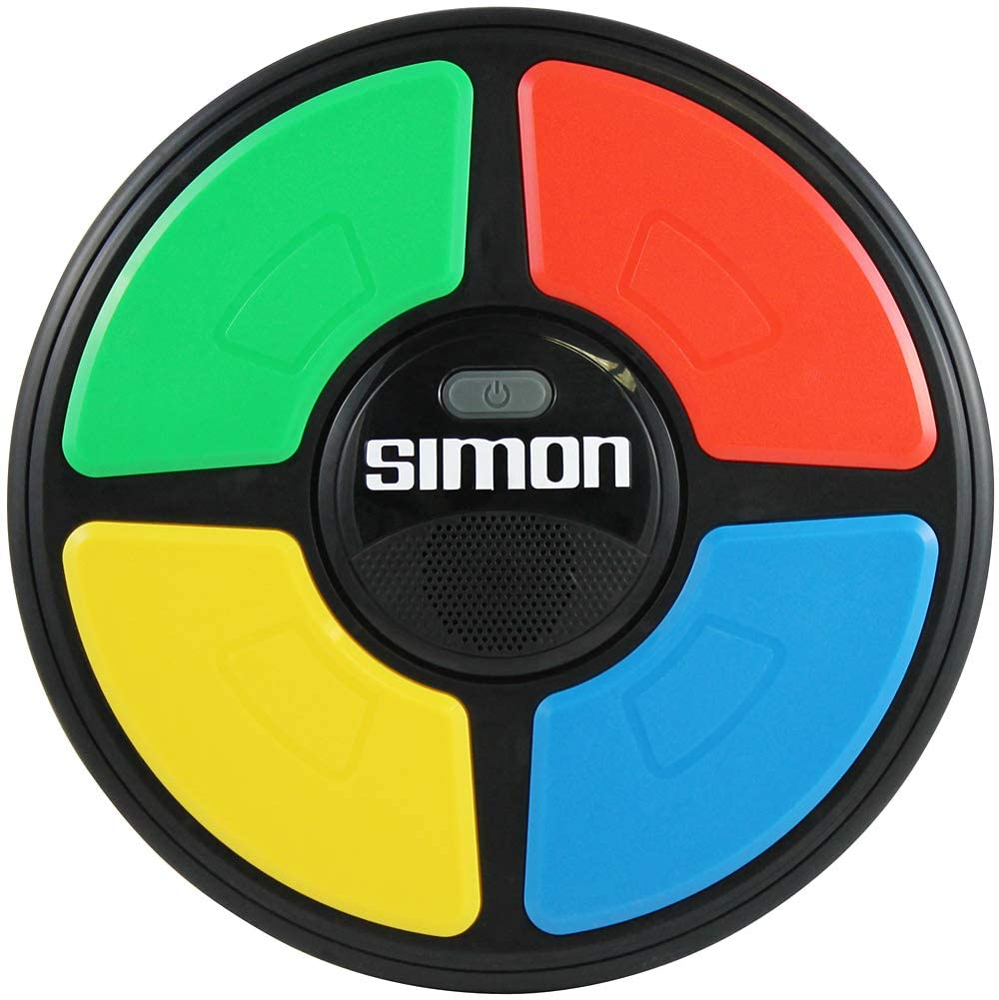
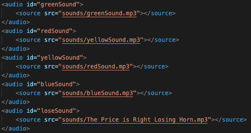
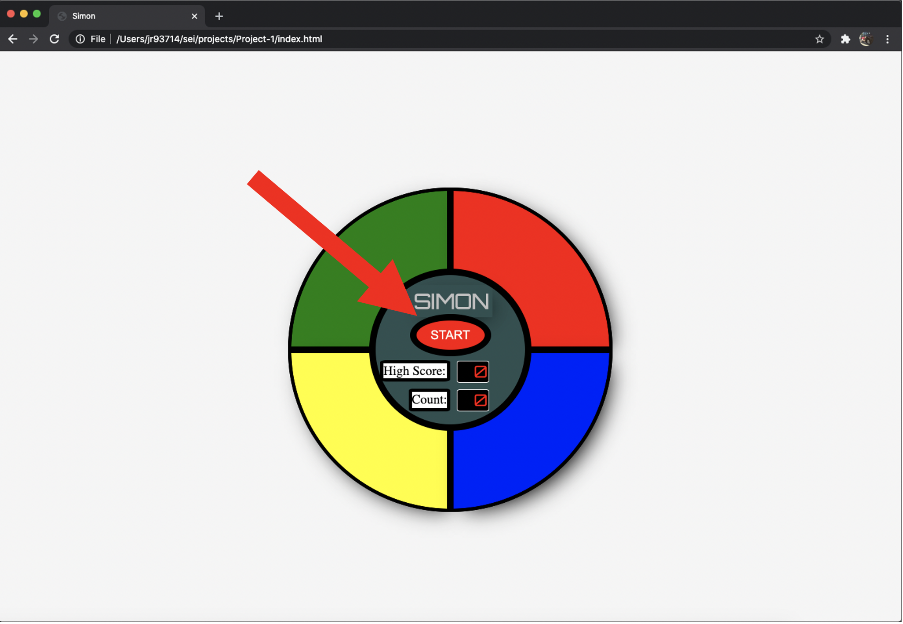
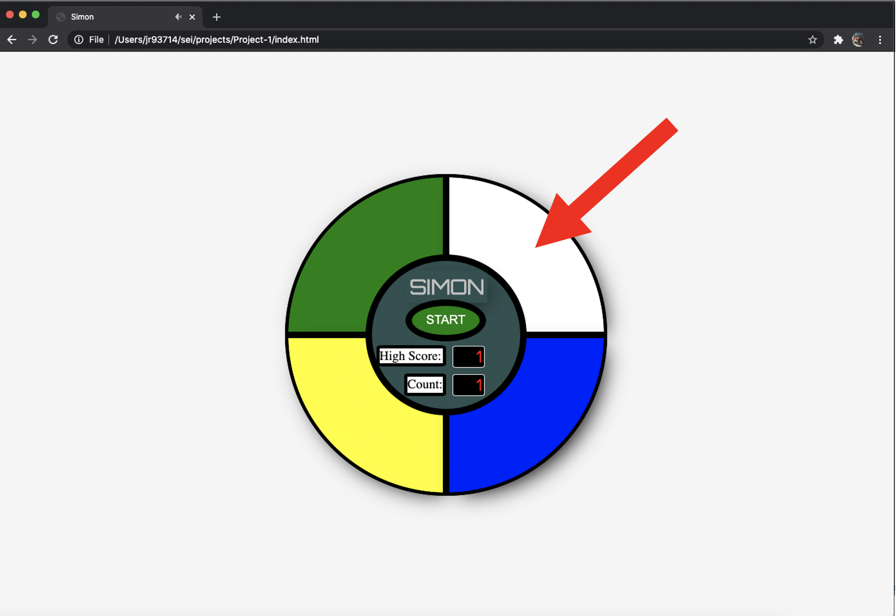

# Project-1
I will be creating a Simon web page game.
- **Description**
  - This project is one of the first major projects completed in the General Assembly SEI Course.
  - The goal of the project was to create an online game with the use of HTML, CSS, and JavaScript.
  - The game that I chose to create was a Simon memory game challenging players to remember and replay a color coded pattern. 
- **Brief Example**
  
  - Once the web page is loaded, to begin the game, the user presses the red "Start" button.
  - A color code is then generated and played back on the screen beginning with one color
  - The user is then required to play back the code by selecting buttons in the same order as the computer generated pattern
  - If the user completes the code correctly then the pattern is extended by a factor of one and played back for the user.
  - The user continues to try recreate the computer generated code until the they make an incorrect selection and the game is over.
- **List of Features**
  - This typically will be a short list of the features / user stories that you planned during the development phase of the project
  - Some additional features that were added to include:
    - A pattern level counter
      - As the player progresses through the challenges and they get long, the count measures how log the patterns are and what "level" the user is on.
    - Highscore history
      - the high score records the highest count that the user has recieved to let them try to beat it in the future.
    - Increased pattern playback speed in future levels
      - As the patterns continue to get longer, more difficulty is added by increasing the speed that the patterns are played back. Making it more difficult on the user.
    - Sound Effects
      - Sound effects are added to the button controls to help give the user feed back on what buttons have been pressed and if they are incorrect in their pattern.
    - Mobile Functionality 
      - The game is function both on the users desktop and mobile device.
**Technology used**
- mp3 Audio files
  - mp3 audio files were installed in the HTML5 page and used in JavaScript with addEventListerns to buttons.
  - This gave the user improved feedback of button presses and game interations.
  
- HTML5
  - The structure of the game was set up through HTML5 and laid the ground work of all the parts of the game.
  - Sound files, JavaScript, CSS stylesheets, and animations are all connect through this file.
- JavaScript ES6
  - setInterval and setTimeout Timers
    - To give the user feedback on what patterns they need to press and what buttons they are pressing setIntervals and setTimeout functions were used to give the player extra time to focus on the game screen.
    - These time intervals were also made variable so that as the levels continue to get harder the speed of the pattern playback increases. 
  - DOM Manipulation
    - With the buttons providing feedback to the user, DOM manipulation in JavaScript was used to connect functions with HTML buttons, classes, and IDs.
    - This was able to be used to update the styling and allow interaction from the user with the JavaScript code through HTML.
- CSS3
  - Animate CSS Classes
    - Animations provided by "Animate.style" were linked into the HTML file and CSS file to give the user a more interactive experience when using the game.

**How To Play**
- Start by loading the gameplay web address: "https://vibrant-murdock-e30e5d.netlify.app/"  
- Once the web address is loaded, a gameboard should appear on your screen
- Begin the game by pressing the red start button

- One of the four buttons will light up with a sound

- Select the same button that was played back for you
- If the user pattern matches the computer pattern the player continues to the next level
- If the user pattern does not match the computer pattern then the game is over and the player will need to press the start button again to play a new game.

